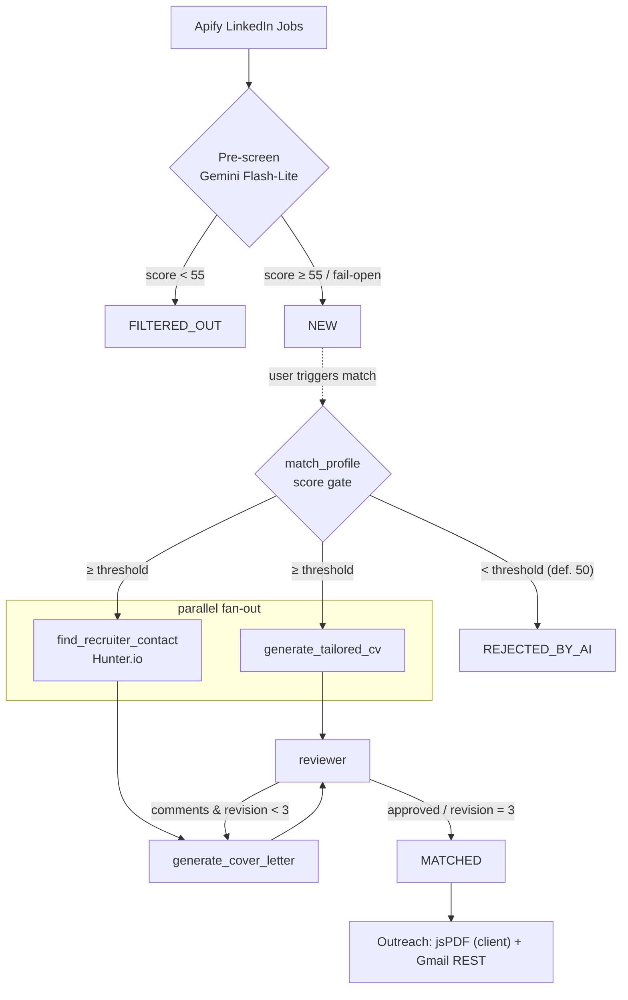

# TargetGraph — Architecture

TargetGraph is an end-to-end **cold-outreach** platform for job seekers: it sources
job postings, scores them against a candidate profile with an LLM pipeline, finds
the hiring manager's contact, generates a tailored CV and a personalised cover
letter, and sends the package by email.

This document is the **canonical, code-accurate** description of the runtime flow.
For deeper per-component specs see [`docs/`](docs/); for the change history see
[`CHANGELOG.md`](CHANGELOG.md).

---

## 1. End-to-end flow

```
┌─────────────┐   ┌──────────────────┐   ┌────────────────────────┐   ┌──────────────┐
│   Apify     │   │  Pre-screening   │   │   LangGraph pipeline    │   │   Outreach   │
│ LinkedIn    │──►│  (Gemini Flash)  │──►│  (parallel CV ∥ Hunter) │──►│  Gmail REST  │
│ Jobs actor  │   │  cheap relevance │   │  + reviewer loop        │   │  + PDF (FE)  │
└─────────────┘   └──────────────────┘   └────────────────────────┘   └──────────────┘
   sourcing            FILTERED_OUT            MATCHED / REJECTED         applied_at set
   (scheduled)          vs NEW                 _BY_AI by score
```



1. **Sourcing — Apify LinkedIn Jobs.** `run_sourcing_job`
   ([backend/app/tasks/sourcing_task.py](backend/app/tasks/sourcing_task.py)) runs
   on an APScheduler **cron** trigger (daily 03:00 UTC,
   [backend/app/main.py](backend/app/main.py)). It OR-joins each profile's target
   titles into one Boolean query, runs the `curious_coder/linkedin-jobs-scraper`
   actor via `ApifyClientAsync`
   ([backend/app/services/sourcing.py](backend/app/services/sourcing.py)), and
   dedups by `source_job_id`. See [docs/Sourcing_Spec.md](docs/Sourcing_Spec.md).

2. **Pre-screening — cheap relevance gate.** Each *new* posting is run through
   `evaluate_job_relevance()` ([backend/app/ai/nodes.py](backend/app/ai/nodes.py))
   using the cheap Gemini Flash-Lite tier. Score `< _PRESCREEN_THRESHOLD` (**55**)
   → status `FILTERED_OUT` (kept in DB for dedup, hidden from the board, never
   re-scored). Otherwise → `NEW`. **Fail-open:** an LLM error or `None` score
   yields `NEW`, so a Gemini outage never silently drops every job.

3. **Matching — LangGraph pipeline.** The user triggers the full pipeline per job
   (REST or WebSocket). The compiled `StateGraph`
   ([backend/app/ai/orchestrator.py](backend/app/ai/orchestrator.py)) runs:
   `extract_requirements` → `match_profile` → score gate → **parallel** branches
   (`find_recruiter_contact` ∥ `generate_tailored_cv`) → `generate_cover_letter`
   → `reviewer` → bounded revision loop. See §3 and
   [docs/AI_Layer_Spec.md](docs/AI_Layer_Spec.md).

4. **Outreach — Gmail REST API.** The frontend renders the tailored CV to PDF
   client-side (jsPDF) and posts it (base64) to `POST /jobs/{id}/outreach/send`.
   The backend sends it via the Gmail API (`gmail.send` scope, OAuth 2.0,
   [backend/app/services/gmail_client.py](backend/app/services/gmail_client.py))
   and stamps `applied_at` on the posting.

---

## 2. Components & tech stack

| Layer | Technology | Notes |
| --- | --- | --- |
| API | **FastAPI** (async) | REST + one WebSocket endpoint; OpenAPI at `/docs` |
| Persistence | **PostgreSQL** (prod) / SQLite (dev/test), **SQLAlchemy 2.0** async (`asyncpg`), **Alembic** | Repository pattern; Unit of Work owned by the request |
| AI orchestration | **LangGraph** `StateGraph`, **langchain-google-genai** (`ChatGoogleGenerativeAI`) | Pydantic `GraphState`; `.with_structured_output()` for scoring |
| Sourcing | **Apify** (`ApifyClientAsync`) | LinkedIn Jobs actor; cron-scheduled |
| Contact discovery | **Hunter.io** v2 `domain-search` | personal-named gate; the live recruiter-lookup mechanism |
| Email delivery | **Gmail API** (REST, OAuth 2.0) | outbound only; `gmail.send` least-privilege scope |
| Scheduling | **APScheduler** (`AsyncIOScheduler`) | wired into the FastAPI lifespan; no Celery/TaskIQ |
| Frontend | **React 19 + TypeScript + Vite**, Tailwind v4, Radix/shadcn-ui, TanStack Query | feature-sliced SPA; jsPDF for CV→PDF |
| Deployment | **Docker** ([infra/docker-compose.yml](infra/docker-compose.yml), [backend/Dockerfile](backend/Dockerfile)) | |

---

## 3. LangGraph pipeline topology

```
                    START
                      │
              extract_requirements
                      │
                 match_profile
                      │
            ┌── should_draft (score gate) ──┐
   score < threshold │                       │ score >= threshold
          │          │                       │
         END   ┌─────┴──────────────────────────────┐
               │                                     │
   find_recruiter_contact                  generate_tailored_cv   ◄── PARALLEL
               │                                     │
       generate_cover_letter                         │
               │                                     │
               └──────────────┬──────────────────────┘
                              │  (fan-in / implicit join)
                          reviewer
                              │
                  ┌── should_revise ──┐
    comments && rev<3 │              │ approved || rev==3
                      │             │
          generate_cover_letter    END
          (letter only, max 3)
```

* **Score gate (`should_draft`).** When `match_score >= score_threshold` the router
  returns the **list** `["find_recruiter_contact", "generate_tailored_cv"]` —
  LangGraph's signal for a parallel fan-out. Below threshold it short-circuits to
  `END`. `score_threshold` defaults to **50** in `GraphState` and is overridable
  per run.
* **Parallel branches.** The two branches write **disjoint** state keys
  (`tailored_cv` vs `cover_letter_draft` / `recruiter_name` / `recruiter_email`),
  so no custom reducer is needed — LangGraph merges them automatically.
* **Fan-in.** Both branches edge into `reviewer`; LangGraph waits for both.
* **Revision loop (`should_revise`).** `reviewer` is a strict fact-check (invented
  experience/skills only, not style). If it leaves comments and
  `revision_number < 3`, the graph loops **only** `generate_cover_letter`. The CV
  is generated once and reused; the Hunter lookup never repeats. Cap = 3.

### Models per node

All nodes use Gemini via `langchain-google-genai`; model/temperature are config-driven
([backend/app/core/config.py](backend/app/core/config.py) `AISettings`):

| Node | Model setting (default) | Temperature |
| --- | --- | --- |
| `extract_requirements`, `match_profile`, `reviewer`, `evaluate_job_relevance` | `GEMINI_MODEL` (`gemini-3.1-flash-lite`) | `0.0` |
| `generate_tailored_cv` | `GEMINI_GENERATION_MODEL` (`gemini-3.1-flash-lite`) | `0.3` (low → no hallucination) |
| `generate_cover_letter` | `GEMINI_GENERATION_MODEL` (`gemini-3.1-flash-lite`) | `0.65` (higher → varied prose) |

> Point `GEMINI_MODEL` / `GEMINI_GENERATION_MODEL` at a Pro tier via env to upgrade
> analysis/generation without code changes.

---

## 4. Cold-outreach details

* **Hunter.io** ([backend/app/services/hunter_client.py](backend/app/services/hunter_client.py)).
  `search_hiring_managers(domain, *, company=None, department="hr", limit=10)` hits
  Hunter v2 `domain-search`. Company identity is chosen by precision:
  `company_website` (Apify) → employer domain from `source_url` (job-board hosts
  like `linkedin.com` are rejected) → `company_name`. The `_is_personal_named`
  gate keeps only `type == "personal"` records **with** a first name, so personal
  greetings are always possible. **Fail-soft:** any error or empty result degrades
  to "no contact found" — the graph still produces a letter with a *"Dear Hiring
  Team,"* fallback. See [docs/AI_Layer_Spec.md](docs/AI_Layer_Spec.md).

* **PDF generation is client-side.** The Markdown CV is rendered to an A4 PDF in
  the browser with jsPDF
  ([frontend/src/features/cover-letters/lib/cvToPdf.ts](frontend/src/features/cover-letters/lib/cvToPdf.ts))
  and uploaded as base64. There is **no** backend PDF library (no WeasyPrint /
  ReportLab).

* **Gmail client.** OAuth 2.0 Desktop-app flow; `credentials.json` / `token.json`
  are git-ignored and path-configurable. Blocking Google API calls run in
  `asyncio.to_thread`; sends are serialised with an `asyncio.Lock`. The MIME
  message (with PDF attachment) is base64url-encoded and sent via
  `users.messages.send`. See [ARCHITECTURE §Gmail in CHANGELOG](CHANGELOG.md).

* **Email-verification engine (standalone).** A custom SMTP/MX/permutation/catch-all
  verifier exists ([backend/app/services/email_verification/](backend/app/services/email_verification/),
  endpoint `POST /api/v1/contacts/verify-email`) but is **not** wired into the live
  matching pipeline — Hunter.io is the sole recruiter-discovery mechanism there.
  See [docs/Email_Verification_Spec.md](docs/Email_Verification_Spec.md).

---

## 5. Real-time streaming

`WS /api/v1/jobs/{job_id}/ws-match?profile_id=<uuid>`
([backend/app/api/v1/jobs.py](backend/app/api/v1/jobs.py)) streams the pipeline
node-by-node via `compiled_graph.astream_events(version="v2")`
([backend/app/services/orchestrator.py](backend/app/services/orchestrator.py)).
Frames: `init` → `extract_requirements` → `match_profile` (with `score`/`reason`)
→ `find_recruiter_contact` → `generate_cover_letter` / `generate_tailored_cv` →
`reviewer` → `done` (or `error`). A watchdog task cancels the graph on client
disconnect so no LLM calls are wasted. See
[docs/Realtime_Matching_Spec.md](docs/Realtime_Matching_Spec.md).

---

## 6. Data model (summary)

Single core table `job_postings` plus the master-profile trio. **Recruiter contact
is stored as columns on `job_postings`** (`recruiter_name`, `recruiter_email`) —
there are no separate `contacts` / `applications` tables.

| Table | Purpose |
| --- | --- |
| `job_postings` | postings + match results + recruiter contact + `applied_at` |
| `master_profiles` | candidate profile (name, target titles, preferences) |
| `profile_experiences` | one-to-many experience entries |
| `profile_skills` | one-to-many skill groups |

`JobStatus` ([backend/app/models/enums.py](backend/app/models/enums.py)):
`NEW`, `MATCHED`, `REJECTED_BY_AI`, `FILTERED_OUT`, `DISCARDED`. Full schema and
column list: [docs/Data_Models.md](docs/Data_Models.md); migrations:
[docs/Migrations.md](docs/Migrations.md).

---

## 7. Cross-cutting invariants

* **Unit of Work.** Service functions `flush`, never `commit`; the **request**
  (FastAPI dependency / streaming write-session) owns the transaction.
* **Fail-soft external I/O.** Apify, Hunter, Gmail and pre-screen all degrade
  gracefully (`None` / `[]` / `NEW`) rather than crashing the caller. See
  [CLAUDE.md](CLAUDE.md) for the binding rules.
* **DB-agnostic graph.** The LangGraph run holds no DB connection: short read
  session → run graph → short write session, so abandoned streams cannot exhaust
  the pool.
